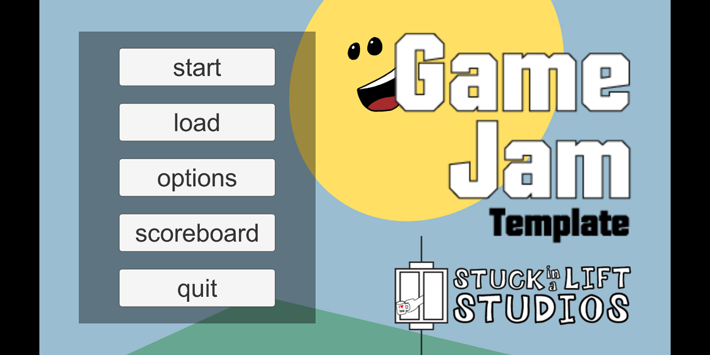

# GameJamTemplate

A simple unity project set up for quick and easy game-jamming.

# What is this, and why does it exist?

*Fed up with spending hours during game jam implementing things you know you’ve already done in every project before?*

*Getting close to the deadline and worrying about whether you should spend time polishing your mechanics, or implementing menu screens and audio options?*

*Want a better alternative?*

I did, so I’ve put together a simple unity project to work as a base template for pretty much any game jam game you can think of (that isn’t networked multiplayer - but seriously don’t even think about it when you’ve got less than 72 hours!).

# What's in it

* 4 Pre-made unity scenes
  * Main Menu
  * Example Gameplay Scene
  * Gameover
  * Testing Scene (for when you need to check model import scale, particle effects, or other stand-alone things you plan to make a prefab of)
* Options Menu
  * Three audio sliders (music, effects, ambient) hooked up to an Audio Mixer
  * Graphics settings
* Highscore system
* Healthbars
* Clock/Timer (counts up or down - currently rigged to 'gameover' when time runs out but this can be easily adpated)
* Interfaces for basic game objects
  * Interactables - shows a prompt when in range, and then responds to a user input (signs, doors, chests etc)
  * Collectables - triggers a function then removes itself from the scene (currently increments score) (coins, stars etc)
  * Hazards - triggers health loss to player but remains in scene (traps, enemies etc)
  * Simple prototyping assets for all of the above
* In game pause menu
* Minimap
 
# What can I do with it?

Make a game!

But seriously, don't just download this, do nothing to change or improve the project, and then pass it off as yours. See this asa a foundation you can use to build off, or just as a handy reference for those basic features that the vast majority of games have in some form or another. Don't upload this to the asset store and try to make money off it.

If you have any suggestions, bug reports, or just want to say 'hey thanks for this, it helped me make my game' drop me a message and I'll make sure I read it and try to address your points. And if you did make a game with this, it would be so awesome to play it - that's what this project exists for after all.

# Disclaimer

Everything is provided 'as is' and I won't be updating this during Ludum Dare/Global Game Jam (because I do those myself). Using this template requires you to understand the fundamentals of building games in unity engine, and basic c# programming knowledge. This project was designed and built in unity 2017 (long-term support) and I have not tested it with older or newer versions of the engine. Update at your own risk!

# Things I plan to add at some point

There are still features I want to make sure this game has going forward which I feel are currently lacking, but aren't yet included. Don't forget to check back here in the future to see what's changed.
* Inventory system
* Hotbar
* Dialog system

## Good Luck, Have Fun
